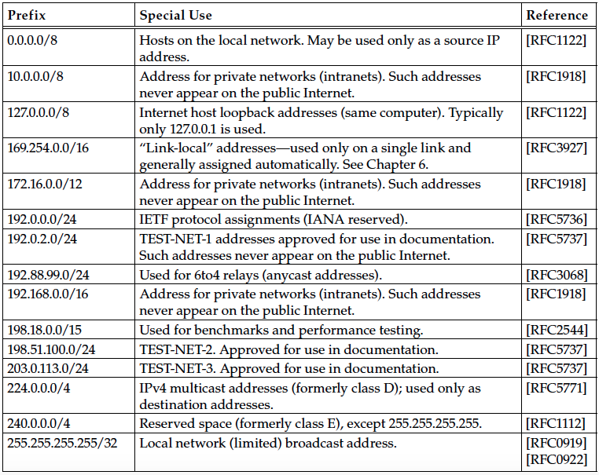

## Chapter 2 The Internet Address Architecture
### IPv6 address: 128 bits; 8 blocks(fields); 4 hex number/block.

* Leading zeros of a block need not be writeen: `5f05:2000:80ad:5800:58:800:2023:1d71`.(注意"58"和"800"前的0被省略不写了)
* Blocks of all zeros can be ommitted and replaced by the notion `::`: `0:0:0:0:0:0:0:1` -> `::1`or `2001:0db8:0:0:0:0:0:2` -> `2001:db8::2`. (`::``在一个IPv6地址里只能用一次)
* IPv4-mapped IPv6 address: `::ffff:10.0.0.1`(hybrid) represents `10.0.0.1`(IPv4).
* IPv4-compatible IPv6 address(low-order 32 bits of the IPv6 address can be written using dotted-quad notation): `::0102:f001` -> `::1.2.240.1`.

> Represent IPv6 in URL(`[]`): `http://[2001:0db8:85a3:08d3:1319:8a2e:0370:7344]:443/`

> [RFC4291]:
> 
> * Leading zeros must be suppressed: `2001:0db8::0022` becomes
`2001:db8::22`
> * `::` must be used for most zeros suppressd
> * use lowercase(a-f) in hexadecimal

### Special-Use Address


### Addressing IPv4/IPv6 Translators
IPv4-embedded IPv6 address

* IPv6 prefix: 32, 40, 48, 56, 64, or 96.
* Bits 64-71 must be set to 0 for compatibility
* "well-known" IPv6 prefix: 64:ff9b::/96 (64:ff9b::198.51.100.16 likeIPv4-mapped IPv6 address)
```
Prefix
Length

  32       IPv6 Prefix | IPv4 Address |   U     |  Suffix    |
            (0-31)       (32-63)        (64-71)   (72-127)

  40       IPv6 Prefix | IPv4 Address |   U   | IPv4 Address |  Suffix  |
           (0-39)        (40-63)       (64-71)     (72-79)      (80-127)

  48       IPv6 Prefix | IPv4 Address |   U   | IPv4 Address |  Suffix  |
           (0-47)        (48-63)       (64-71)     (72-87)      (88-127)

  56       IPv6 Prefix | IPv4 Address |   U   | IPv4 Address |  Suffix  |
           (0-55)        (46-63)       (64-71)     (72-95)      (96-127)

  64               IPv6 Prefix        |   U   | IPv4 Address |  Suffix  |
                    (0-63)             (64-71)     (72-103)     (104-127)

  96                  IPv6 Prefix                     |    IPv5 Address
                       (0-95)                               (96-127)
```

### Multicast Addresses
> also called group or group address

`scope` of the group: The portion of the network that a single group

* node-local(same computer)
* link-local(same subnet)
* site-local(applicable to some site)
* global(entire Internet)
* administrative

> Note that the site-local and administrative scopes are available for use only with multicast addressing

IPv4 Multicast Address (224.0.0.0-239.255.255.255)
UBM(unicast-prefix-based multicast addressing)
```
       234  | Unicast Prefix    |  Group ID      
    (8 bits)   (up to 24 bits)    (up to 16 bits)

For example:
    the unicast IPv4 address prefix 192.0.2.0/24 --> 234.192.0.2
```

IPv6 Multicast Addresss
prefix ff00::/8
```
11111111 |0|R|P|T| Scope(4 bits) | Group ID (112bits)
          Flags
```
[没有读完]
