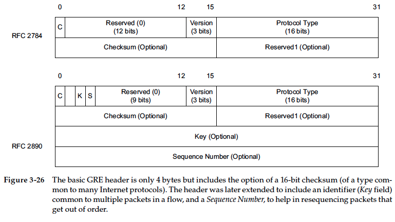
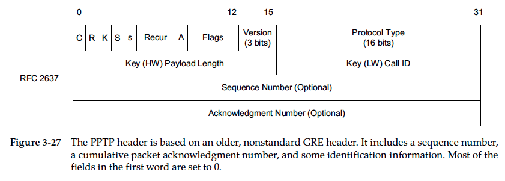

## Chapter 3. Link Layer
### link-layer PDUs: frame
> The upper bound of the range is called the maximum transmission unit (MTU)

### The Ethernet Frame Format
```
 +-------------------------------------------------------------------------+
 |        |S|   |   |    ||P/Q|Other| Upper-Layer Proctocal|P||F|Carrier   |
 |Preamble|F|DST|SRC|Type||Tag|Tags | Palyload (typically  |a||C|Extension |
 |        |D|   |   |    ||   |     | up to 1500 bytes)    |d||S|(1/2 Dup) |
 +-------------------------------------------------------------------------+
 (7 bytes) 1 (6)  6  (20) (0/2)      (0-1982)             (0+)(4) (variable)
```

* `Preamble`: to determine when a frame is arriving and to determine the amount of time between encoded bits (called clock recovery).
* `start frame delimiter (SFD)`: has fixed value )xAB
* DST (destination) & SRC (source): 48-bit (6 byte) "MAC address" "link-layer address", "802 address", "hardware address", or "physical address".
* Type: IPv4(0x0800), IPv6 (0x86DD), ARP (0x0806), Q-tagged (0x8100, can carry virtual LAN)

### CRC校验:
发送端,发送数据10110011:

* 除数Generator polynomial: G(X) = X**4 + X**3 + 1 = 11001，5位
* 因为Generator polynomial是5位，所以CRC校验码5-1=4位
* 数据后补4个0000(与CRC校验码位数相同)，即101100110000
* 数据与除数进行模2除法，得到余数0100
* 新的frame为原数据 +(append) CRC校验码，即101100110100, 发送到接收端

接收端:

* 得到data和FCS中的CRC校验码
* data与CRC校验码进行模2除法，如果余数为0，数据正确，如果不为0，数据错误

> if a frame contains an error (detected on receipt by an incorrect CRC)

### Bridges and switches
#### VLAN
virtual LANs (VLANs) in a standard known as 802.1q [802.1Q-2005].

> two hosts attached to the same switch but operating on different VLANs require a router between them for traffic to flow.

VLAN tag:

* VLAN identifier: label Ethernet frames. (12 bits, providing for 4096 VLANs, although VLAN 0 and VLAN 4095 are reserved)
* QoS: 3 bits of priority
```bash
Linux# vconfig add eth1 2
Added VLAN with VID == 2 to IF -:eth1:-

Linux# ifconfig eth1.2
eth1.2 Link encap:Ethernet HWaddr 00:04:5A:9F:9E:80
BROADCAST MULTICAST MTU:1500 Metric:1
RX packets:0 errors:0 dropped:0 overruns:0 frame:0
TX packets:0 errors:0 dropped:0 overruns:0 carrier:0
collisions:0 txqueuelen:0
RX bytes:0 (0.0 b) TX bytes:0 (0.0 b)

Linux# vconfig rem eth1.2
Removed VLAN -:eth1.2:-

Linux# vconfig set_name_type VLAN_PLUS_VID
Set name-type for VLAN subsystem. Should be visible in
/proc/net/vlan/config

Linux# vconfig add eth1 2
Added VLAN with VID == 2 to IF -:eth1:-

Linux# ifconfig vlan0002
vlan0002 Link encap:Ethernet HWaddr 00:04:5A:9F:9E:80
BROADCAST MULTICAST MTU:1500 Metric:1
RX packets:0 errors:0 dropped:0 overruns:0 frame:0
TX packets:0 errors:0 dropped:0 overruns:0 carrier:0
collisions:0 txqueuelen:0
RX bytes:0 (0.0 b) TX bytes:0 (0.0 b)
```

#### Link Aggregation
> two or more interfaces are treated as one.

`Link Aggregation Control Protocol` (LACP): use `LACPDUs`

```bash
Linux# modprobe bonding
Linux# ifconfig bond0 10.0.0.111 netmask 255.255.255.128
Linux# ifenslave bond0 eth0 wlan0
```
* `modprobe bonding`: load driver
* `ifconfig bond0...`: creates the bond0 interface
* `ifenslave`: bond0, is labeled with the MASTER flag, and the eth0 and wlan0 devices are labeled with the SLAVE flag.

#### Wake-on LAN(Wol)
Wake-On options are used to bring the network interface and/or host computer out of a lower-power (sleep) state based on the arrival of certain kinds of packets.
```bash
Linux# ethtool –s eth0 wol umgb

Linux# wol 00:08:74:93:C8:3C
Waking up 00:08:74:93:C8:3C...
```
* `p`: physical-layer (PHY) activity
* `u`: unicast frames destined for the station
* `m`: multicast frames
* `b`: broadcast frames
* `a`: ARP frames
* `g`: magic packet frames
* magic packet frames including a password

#### Link-Layer Flow Control
`PAUSE` frames: PAUSE messages are contained in MAC control frames, identified by the Ethernet Length/Type field having the value 0x8808 and using the MAC control opcode of 0x0001.

#### bridges
```bash
Linux# brctl addbr br0
Linux# brctl addif br0 eth0
Linux# brctl addif br0 eth1
Linux# ifconfig eth0 up
Linux# ifconfig eth1 up
Linux# ifconfig br0 up
```
`forwarding database`:
```bash
Linux# brctl show
bridge name bridge id STP enabled interfaces
br0 8000.0007e914a9c1 no eth0 eth1

Linux# brctl showmacs br0
port no mac addr is local? ageing timer
1 00:04:5a:9f:9e:80 no 0.79
2 00:07:e9:14:a9:c1 yes 0.00
1 00:08:74:93:c8:3c yes 0.00
2 00:14:22:f4:19:5f no 0.81
1 00:17:f2:e7:6d:91 no 2.53
1 00:90:f8:00:90:b7 no 17.13
```
`ageing`: each time an address is learned, a timer is started (commonly defaulted to 5 minutes)
```bash
Linux# brctl setageing br0 1
Linux# brctl showmacs br0
port no mac addr is local? ageing timer
1 00:04:5a:9f:9e:80 no 0.76
2 00:07:e9:14:a9:c1 yes 0.00
1 00:08:74:93:c8:3c yes 0.00
2 00:14:22:f4:19:5f no 0.78
1 00:17:f2:e7:6d:91 no 0.00
Here,
```
#### floading
frames for the removed destination are once again sent out of every port except the receiving one (called flooding)
#### Spanning Tree Protocal
> Prevent frame looping

Links cost:

* 10 Mb/s: 100
* 100 Mb/s: 19
* 1000 Mb/s (1 Gb/s): 4
* 10 Gb/s: 2

#### port states and roles
* Each port in each bridge may be in one of five states: 
`blocking`, `listening`, `learning`, `forwarding`, and `disabled`.
* A port may have the role of `root port`, `designated port`, `alternate port`, or `backup port`

#### BPDU
BPDUs are always sent to the group address `01:80:C2:00:00:00`
[Page 106]

#### Building the Spanning Tree
elect root bridge: smallest (`Bridge ID`)identifier (priority combined with MAC address).

#### Enable STP on Linux
```bash
Linux# brctl stp br0 on

Linux# brctl showstp br0
```

#### RSTP
> The main improvement in RSTP over STP is to monitor the status of each port and upon indication of failure to immediately trigger a topology change indication.

reduces the normal STP five port states to three:

* discarding: disabled, blocking, and listening
* learning
* forwarding

New port role: `alternate` port

No `TCN BPDUs` for topology change.

#### Mulitple Registration Protocol (MRP)
> provides a general method for registering attributes among stations in a bridged LAN environment.

* MVRP (for registering VLANs)
* MMRP (for registering group MAC address)

#### Wireless LANs - IEEE 802.11 (Wi-Fi)
* infrastructure mode: AP(access point); BSS(basic service set); DS(distribution service, "backbone"); ESS (extended service set)
* ad hoc mode: station-to-station(p2p)

A WLAN formed from a collection of BSSs and/or IBSSs is called a service set, identified by a service set identifier (SSID).

#### 802.11 Frames
MAC PDU(MPDU)
Page 113

* Management Frames: Management frames are used for creating, maintaining, and ending associations between stations and access points. (determin encrytion is being used or not, SSID/ESSID, transmission rates). For "scans" nearby access points.
    ```
    Linux# iwlist wlan0 scan
    wlan0 Scan completed :
            Cell 01 - Address: 00:02:6F:20:B5:84
                    ESSID:"Grizzly-5354-Aries-802.11b/g"
                    Mode:Master
                    Channel:4
                        Frequency:2.427 GHz (Channel 4)
                    Quality=5/100 Signal level=47/100
                    Encryption key:on
                    IE: WPA Version 1
                        Group Cipher : TKIP
                        Pairwise Ciphers (2) : CCMP TKIP
                        Authentication Suites (1) : PSK
                    Bit Rates:1 Mb/s; 2 Mb/s; 5.5 Mb/s; 11 Mb/s;
                        6 Mb/s; 12 Mb/s; 24 Mb/s; 36 Mb/s; 9 Mb/s;
                        18 Mb/s; 48 Mb/s; 54 Mb/s
                    Extra:tsf=0000009d832ff037
    ```

* Control Frames: RTS(request-to-send)/CTS(clear-to-send) and ACKs. To slove "hidden terminal" problems.
    ```
    Linux# iwconfig wlan0 rts 250
    wlan0 IEEE 802.11g ESSID:"Grizzly-5354-Aries-802.11b/g"
                Mode:Managed
                Frequency:2.427 GH
                Access Point: 00:02:6F:20:B5:84
                Bit Rate=24 Mb/s Tx-Power=0 dBm
                Retry min limit:7 RTS thr=250 B Fragment thr=2346 B
                Encryption key:xxxx- ... -xxxx [3]
                Link Quality=100/100 Signal level=46/100
                Rx invalid nwid:0 Rx invalid crypt:0 Rx invalid frag:0
                Tx excessive retries:0 Invalid misc:0 Missed beacon:0
    ```
    例如, A向B发送RTS信号，表明A要向B发送若干数据，B收到RTS后，向所有基站发出CTS信号，表明已准备就绪，A可以发送，而其余欲向B发送数据的基站则暂停发送.
    ACK: in order to address frames not be delivered correctly (retransmission). An acknowledgment is expected to be received within a certain amount of time for each unicast frame sent (802.11a/b/g) or each group of frames sent (802.11n or 802.11e with “block ACKs”).
    disable RTS/CTS: set RTS/CTS thresholds to hight value

* Data Frames, Fragmentation, and Aggregation: 
    * A-MSDU: 802.3 Header, all use one FCS
    * A-MPDU: 802.11 MAC Header, each has own FCS

#### Power Save Mode (PSM) and the Time Sync Function (TSF)
* PSM: `Frame Control Word` bit is seted, AP notices this bit amd buffers any frames for the station until the station requests them.
* TSF: Wi-Fi synchronizes time.

#### 802.11 Media Access Control
Three approaches:

* point coordination function (PCF):
* distributed coordinating function (DCF): is a form of CSMA/CA for contention-based access to the medium.
    * Virtual Carrier Sense, RTS/CTS, and the Network Allocation Vector (NAV)
    * Physical Carrier Sense (CCA)
used for both infrastructure and ad hoc operation
* hybrid coordination function (HCF)

### Tunneling Basics
> Tnuneling is the idea of carrying lower-layer traffic in higher-layer (or equal-layer) packets.

* `Generic Routing Encapsulation (GRE)`:
    
    * `C` (checksum): whether a checksum is present. If it is, the `Checksum` field contains the same type of checksum found in many Internet-related protocols.
    * `Reserved1`: if the `C` field is presentm the `Reserved1` is also present and is set to 0.
    **extend**:
    * `Key`: present if set to 1, the `Key` field is arranged to be a common value in multiple packets, indicating that they belong to the same flow of packets. 
    * `Sequence Number`: present if set to 1, is used in order to reorder packets.
    > GRE tunnels are typically used within the network infrastructure to carry traffic between ISPs or within an enterprise intranet to serve branch offices and are not necessarily encrypted, although GRE tunnels can be combined with IPsec. GRE carries its traffic using IPv4 or IPv6 and as such is a layer 3 tunneling technology. 
* `Point-to-Point Tunneling Protocol (PPTP)`:
    
    * `K`: if set to 1, `Key` field is present.
    * `S`: if set to 1, `Sequence Number` field, which will holds the largest packet number seen by the peer.
    * `A`: if set to 1, `Acknoledgement` field is present.
* `Layer 2 Tunneling Protocol (L2TP)`: is often used with security at the IP layer (IPsec) because L2TP by itself does not provide security.

*未完成....*
