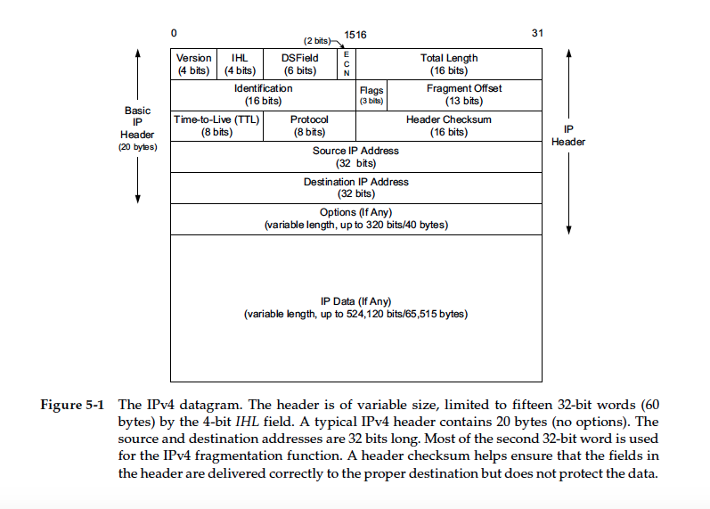
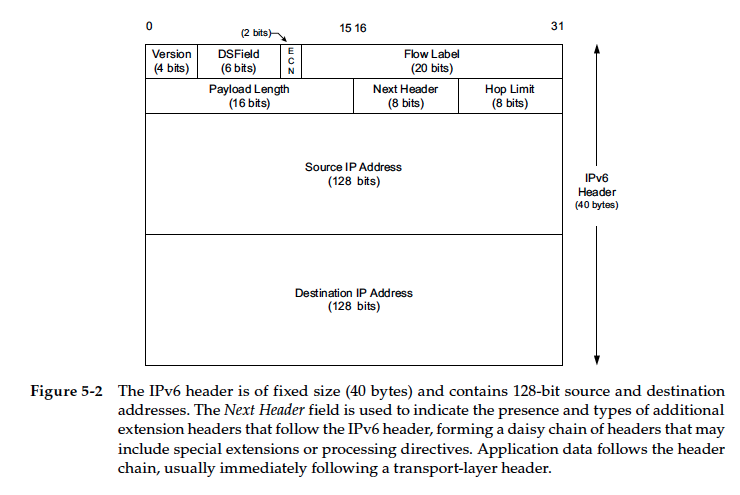

## Chapter 5 The Internet Protocal(IP)
### IP Header Fields
#### IPv4

> IPv4 header is limited to a maximum of fifteen 32-bit words or 60 bytes.
> `big endian` bytes ordering( AKA `network byte order`)

* `version number`: 4 bits.
* Internet Header Length (`IHL`): 4 bits. The normal value of this field (when no options are present) is 5, reprents number os 32-bit words in the IPv4 Header (5 * 32-bit = 20 bytes, which is Basic IP header).
* Type of Service (`ToS`): 8 bits. Use of these never became widespread.
    * Differentiated Service Field (`DS Field`): 6 bits
    * Explicit Congestion Notification (`ECN`): 2 bits.
* `Total Length`: 16 bits. The length of the IPv4 datagram in bytes. So the maximun of IPv4 datagram(including header) is 2**16 = 65535 bytes.
* `Identification`: chapter 10 (fragmentation)
* `Flags`:
* `Fragment Offset`:
* Tiem-to-Live (`TTL`): 8 bits
    * sets an upper limit on the number of routers through which a datagram can pass. (64 is recommended, sometimes 128 or 255). 
    * decremented by 1 by every router that forwards the datagram.
    * when it reaches 0. throw away and the sender receives a ICMP message.
* `Protocal`: 8 bites. Contains a number indicating the type of data found in the payload portion of the datagram (17-UDP, 6-TCP). Demultiplexing feature.
* `Header Checksum`: calculated over the IPv4 header only(即只计算IPv4 header, 而不计算datagram). The payload of the IPv4 datagram (e.g., TCP or UDP data) is not checked for correctness by the IP protocol.
* Source IP Address: 32 bits
* Destination IP Address: 32 bits

> A host is not required to be able to receive an IPv4 datagram larger than 576 bytes.

#### IPv6

> The IPv6 header does not have any checksum field.

* `version number`: 6 bits.
* Traffic Class byte: 8 bits. Use of these never became widespread.
    * Differentiated Service Field (`DS Field`): 6 bits
    * Explicit Congestion Notification (`ECN`): 2 bits.
* `Flow Label`: 20 bits.
* `Payload Length`: 16 bits. IPv6 not support fragmentation by the header. The value is the length of the IPv6 datagram (not include the **length of the header**, but include **extension headers**),
* `Next Header`: 8 bites. The Next Header field in the IPv6 header generalizes the Protocol field from IPv4. It is used to indicate the type of header following the IPv6 header.
* Hop Limits: as IPv4 **TTL**.
* Source IP Address: 128 bits.
* Destination IP Address: 128 bits.

#### The internet checksum
The internet checksum is 16 bits:

* 先将checksum都set to 0.
* `end-round-carry addition`:将除checksum field之外的header以16-bit(4位hex)划分, 依次相加:
    ```
      Binary                Hex

      1001000110010100      9194

    + 1000000001110011      8073

      ----------------

    1 0001001000000111     11207

    +                1

      ----------------

      0001001000001000      1208
    ```
    如果两两相加有进位, 则把进位1加到后十六位的最后一位(`one’s complement`), 例如one's complement sum(4500, 0073, 0000, 4000, 4011, C0A8, 0001, C0A8, 00C7) = 1433
* 将1433的每一位取反(0->1, 1->0), 就得到checksum：EBCC, EBCC则为checksum field的值
* 此时header为`9194 8073 0000 4000 4011 EBCC C0A8 0001 C0A8 00C7`
* IP包的接收方在接收到IP包之后，可以求上面各个16位数的one's complement sum，应该得到FFFF。如果不是FFFF，那么header是不正确的，整个IP包会被丢弃。

