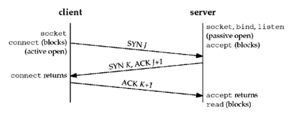
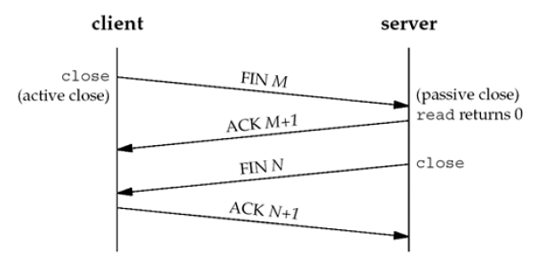

## Chapter 2. The Transport Layer: TCP, UDP, and SCTP
### TCP Options
Each SYN can contain TCP options:

* MSS(maximum segment szie): With this option, the TCP sending the SYN announces its maximum segment size, the maximum amount of data that it is willing to accept in each TCP segment, on this connection. Each end uses the other end's MSS value as the maximum size of a segment.

* Window scale option: due to that the file in the TCP header corresponding to maximum advertised window is 65535bytes(16 bits, 2^16). This new option specifies that the window can be scaled(left-shifted) by 0-14 bits. So the maximum window size is (65535 * 2^14). Both end-systems must support this option.

* Timestamp option.

> `Window scale option` and `Timestamp option` are called "long fa pipe options".

### TCP Connection Establishment
Three-Way Handshake  

prerequisite: The server end ready to accept an incoming connection.(passive open: socket, bind, listen)

1. The client(active open): call `connect`, which will send a "synchronize"(SYN) segment, with initial sequence number(for instance, "J") and IP header, TCP header and possible TCP options.
2. The server acknowledge(ACK) the client's SYN. And then sent a server's SYN K and the ACK J+1 back to the client.
3. The client acknowledge the server's SYN, sent ACK K+1 to server.

### TCP Connection Termination
Four-way Termination

1. "active close" to call `close` function, `close` a FIN M segment to be sent.(for instance, client --> server)
2. The other end receives the FIN, and performs the passive close. The received FIN is acknowledged by TCP, and as a EOF passed to applicaiton(server end). Sent back ACK M+1.(server --> client)
3. Application `close` this socket after received the EOF and cause its sent a FIN N.(server --> client)
4. final FIN received("active close" end), its TCP acknowledges the FIN. Sent a ACK N+1.(client --> server)

Both client and server can perform the "active close".

### piggyback捎带
Like server sent SYN with ACK.

### TCP State Transition Diagram

### TIME_WAIT
TIME_WAIT is 2 * MSL(maximum segment lifetime).  
The MSL is the maximum amount of time that any given IP datagram can live in a network.

TIME_WAIT state:

1. To implement TCP's full-duplex connection termination reliably
2. To allow old duplicate segments to expire in the network

### SCTP Connection Establishment
Four-way handshake  
prerequisite: The server end ready to accept an incoming connection.(passive open: socket, bind, listen)  

1. (active open)Client call `open` or send a message to implicitly open a association. This causes the client to send an INIT message to tell the client's list of IP addresses, initial sequence number, initiation tag to identify all packets in this association, number of outbound streams the client is requesting, and number of inbound streams the client can support.  
(client --INIT(TagA, J)--> server)  
2. The server acknowledges the client's INIT message and send an INIT-ACK message back with relative info like client, plus a state cookie.  
(server --(TagA: INIT ACK(TagZ, K, COOKIE C)))  
3. The client echos the server's state cookie with a COOKIE-ECHO message.(may also contains user data)  
(client --(TagZ: COOKIE ECHO C))  
4. The server acknowledges that the cookie was correct and that the association was established with a COOKIE-ACK message.(may also contains user data)  
(server --TagA:COOKIE ACK--> client)  
The tag TagA must be present in every packet sent by the peer(for instance, server) for the life of the association. The initial sequence number J is used as the starting sequence number for DATA messages termed DATA chunks.  
The same as TagZ and K.  

Each side chooses a primary destination address.

### Association Termination
Unlike TCP, SCTP does not permit a "half-closed" association. When one end shuts down an association, the other end must stop sending new data.

1. (active close)The client call `close` ande sent SHUTDOWN.
2. (passive close)The server `read` and send back SHUTDOWN-ACK.
3. The client sent SHUTDOWN-COMPLETE.

**Note:** The unit of information within an SCTP packet is a "chunk."

### SCTP Options
1. The dynamic address extension.
2. The partial reliability extension.

### Port
16-bit integer port numbers.  
The port numbers are divided into three ranges.
1. The well-known ports: 0 - 1023, controlled and assigned by the IANA.
2. The registered ports: 1024 - 49151, IANA registers and lists the uses of these ports as a convenience to the community.
3. The dynamic or private ports: 49152 - 65535. These are what we called ephemeral ports.

### Buffer Sizes and Limitations

* The maximum size of an IPv4 datagram is 65,535 bytes, including the IPv4 header. This is because of the 16-bit total length.

* The maximum size of an IPv6 datagram is 65,575 bytes, including the 40-byte IPv6 header. This is because of the 16-bit payload length field

* Many networks have an MTU which can be dictated by the hardware.  
The minimum link MTU for IPv4 is 68 byte.  
The minimum link MTU for IPv6 is 1,280 bytes.

* The smallest MTU in the path between two hosts is called the path MTU.

* If the size of the datagram exceeds the link MTU, fragmentation is performed by both IPv4 and IPv6.  
IPv4 host and IPv4 router are both performed fragmentation on datagrams.
IPv6 only hosts perform fragmentation datagrams. But if IPv6 routers generate
datagrams itself, they perform like hosts(do fragmentation).

* (IPv4)If "don't fragment(DF)" is set, hosts and routers would not perform fragmentation. In this situation, if datagram exceeds MTU, router would generate a ICMPv4 error message "destination unreachable, fragmentation needed but DF bit set".  
(IPv6)If the datagram exceeds MTU size, and there is a "implied DF" bit is set, the router would generate a ICMPv6 "packet too big" error message.  
The IPv4 DF bit and its implied IPv6 counterpart can be used for path MTU discovery.

* minimum reassembly buffer size:  
IPv4: 576 bytes.
IPv6: 1500 bytes.

* TCP has a maximum segment size (MSS) that announces to the peer TCP the maximum amount of TCP data that the peer can send per segment. MSS is 65535.

* SCTP keeps a fragmentation point based on the smallest path MTU found to all the peer's addresses.

